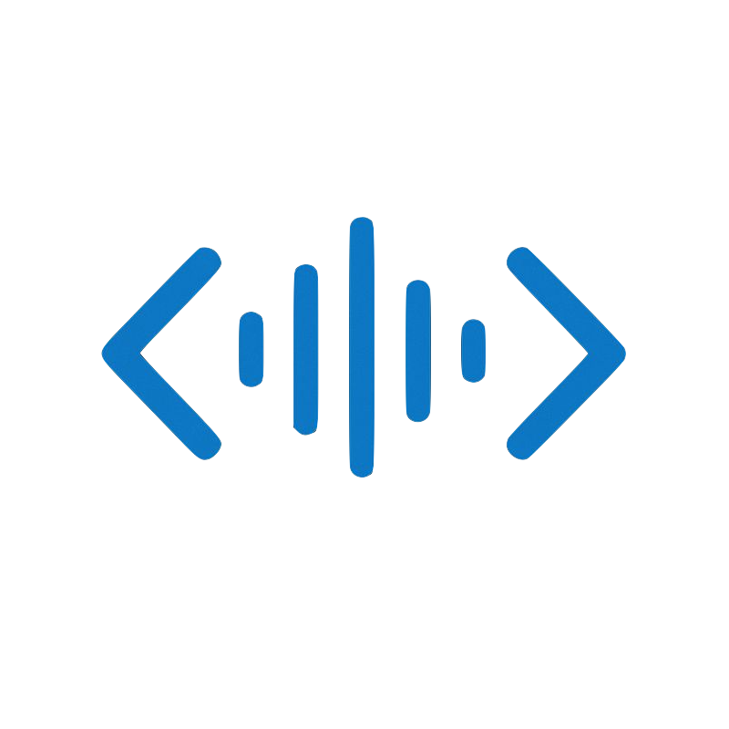

<p align="center">
  
</p>

# Vocal Studio Code

Un assistant de programmation qui modifie votre code via des commandes vocales, propulsé par **Gradium.ai**, **OpenAI GPT-4**, **LangGraph** et **Gradio**.


## Fonctionnalités

- Reconnaissance vocale en temps réel avec Gradium.ai
- Édition intelligente de code en deux étapes (analyse puis génération)
- Protection anti-écrasement : préserve les modifications utilisateur pendant les appels LLM
- Préservation automatique de l'indentation
- Historique des modifications avec horodatage
- Interface web moderne avec Gradio 6.0

## Installation

### Prérequis

- Python 3.10+
- Clés API : [Gradium.ai](https://gradium.ai) et [OpenAI](https://platform.openai.com)

### Étapes

```bash
# Cloner et configurer
git clone https://github.com/colinfrisch/voice-hack.git
cd voice-hack
python3 -m venv venv
source venv/bin/activate
pip install -r requirements.txt

# Configurer les clés API dans un fichier .env
echo "GRADIUM_API_KEY=votre_cle_gradium" >> .env
echo "OPENAI_API_KEY=votre_cle_openai" >> .env

# Lancer
python3 app.py
```

Accédez ensuite à http://127.0.0.1:7860

## Utilisation

### Mode Vocal

1. Parlez votre instruction (ex: "Ajoute une fonction pour calculer la somme")
2. L'application transcrit, analyse et applique les modifications

### Mode Texte

Tapez directement vos instructions dans la zone de texte.

### Exemples de commandes

- "Ajoute une docstring à la fonction main"
- "Renomme la variable x en total_count"
- "Crée une classe User avec un attribut name"
- "Ajoute la gestion des erreurs avec try-except"

## Architecture

```
┌─────────────────┐
│ Commande Vocale │
└────────┬────────┘
         │
         ▼
┌─────────────────────────────────────────────────┐
│              LangGraph Workflow                 │
│  ┌───────────┐  ┌──────────┐  ┌─────────────┐  │
│  │   Parse   │→ │ Analyze  │→ │  Generate   │  │
│  └───────────┘  └──────────┘  └──────┬──────┘  │
│                                      │         │
│  ┌─────────────────────────────────────────┐   │
│  │   Apply (avec détection conflits)       │   │
│  └─────────────────────────────────────────┘   │
└─────────────────────────────────────────────────┘
         │
         ▼
┌─────────────────┐
│  Code Modifié   │
└─────────────────┘
```

| Fichier | Description |
|---------|-------------|
| `app.py` | Point d'entrée principal |
| `graph.py` | Workflow LangGraph (analyse → génération → application) |
| `ui.py` | Interface Gradio |
| `handlers.py` | Traitement des commandes |
| `transcription.py` | Intégration Gradium.ai |
| `config.py` | Configuration |

## Sécurité

- Ne commitez jamais votre fichier `.env`
- Ajoutez `.env` à `.gitignore`
- Révoquez immédiatement toute clé exposée

## Contribution

1. Fork le projet
2. Créer une branche (`git checkout -b feature/amelioration`)
3. Commit et push
4. Ouvrir une Pull Request
